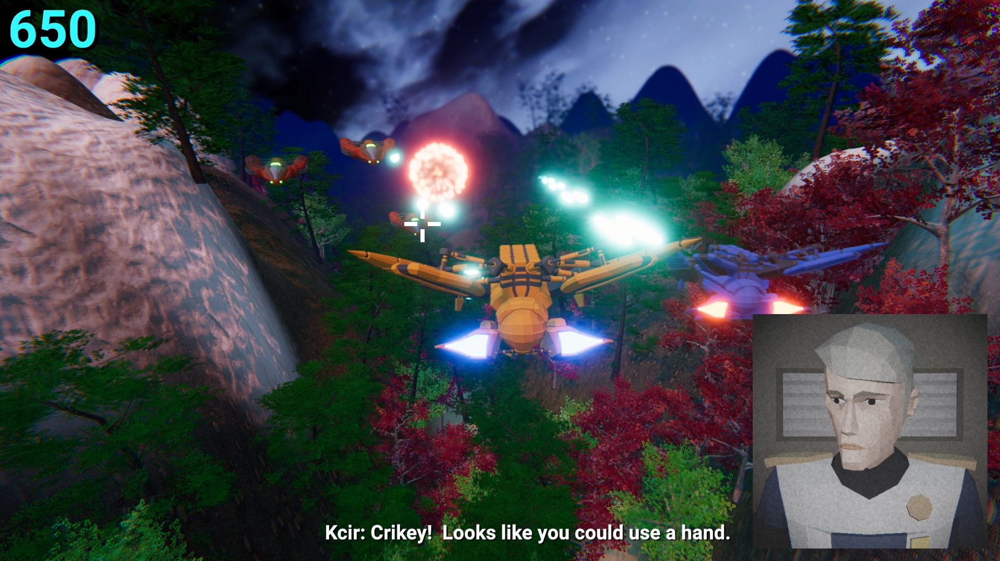

# Galaxy Strike

A 3D rail-based space shooter developed in Unity. The project focuses on cinematic movement, dynamic combat encounters, and scripted events using advanced Unity tools.

## Gameplay Preview

## Key Technical Features

*   **Timeline-Driven Movement:** Leverages Unity Timeline to create complex, "on-rails" flight paths and precisely timed gameplay events.
*   **Particle-Based Combat:** Weapon system implementation using Unity's Particle System for both player and enemy projectiles, including visual hit effects.
*   **Scripted Dialogue & Events:** Mission narration and character dialogue synchronized with the player's progression through the level.
*   **Cinematic Flight Pathing:** Direct control over the player's transform and mission pacing via integrated Timeline tracks.

## Built With

*   Unity (Universal Render Pipeline)
*   Unity Timeline
*   C# for gameplay logic and event handling

## How to Run

1. Clone this repository.
2. Open the project in Unity (Version 6000.0.28f1).
3. Navigate to `Assets/Scenes` and open the 'MainLevel'.
4. Press Play to start the mission.
